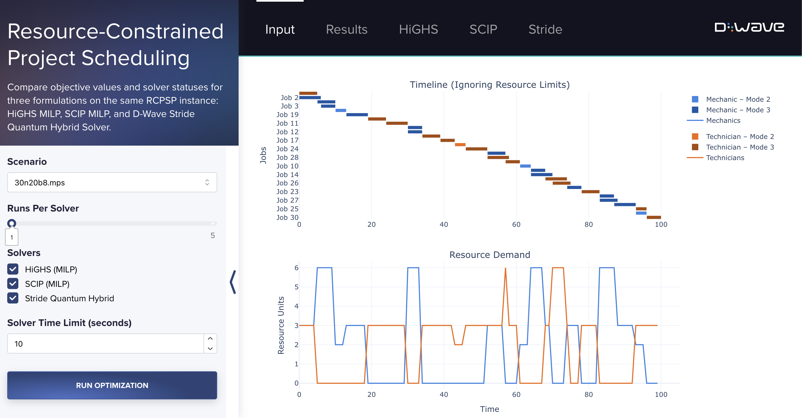
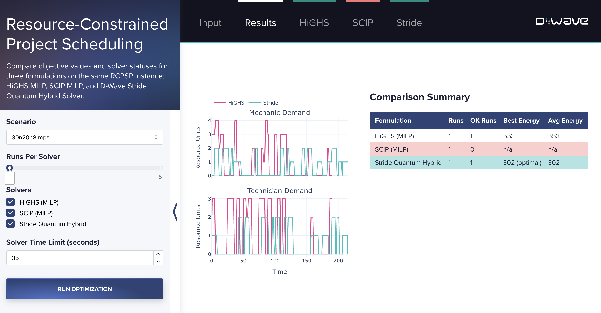

# Resource-Constrained Project Scheduling

This demo solves a **Resource-Constrained Project Scheduling Problem (RCPSP)** and
compares three solvers side-by-side: HiGHS (MILP), SCIP (MILP), and D-Wave's
Stride quantum hybrid solver. RCPSP is a canonical combinatorial optimization
problem in the operations research and scheduling domains and is NP-hard in
general.

The included instance (`30n20b8.mps`) has 30 jobs, 2 renewable resource types
(mechanics and technicians), and up to 3 execution modes per job. The known
optimal objective value is **302**.




## Installation
You can run this example without installation in cloud-based IDEs that support the
[Development Containers Specification](https://containers.dev/supporting) (aka "devcontainers")
such as GitHub Codespaces.

For development environments that do not support `devcontainers`, install requirements:

```bash
pip install -r requirements.txt
```

If you are cloning the repo to your local system, working in a
[virtual environment](https://docs.python.org/3/library/venv.html) is recommended.

## Usage
Your development environment should be configured to access the
[Leap&trade; quantum cloud service](https://docs.dwavequantum.com/en/latest/ocean/sapi_access_basic.html).
You can see information about supported IDEs and authorizing access to your Leap account
[here](https://docs.dwavequantum.com/en/latest/ocean/leap_authorization.html).

Run the following terminal command to start the Dash application:

```bash
python app.py
```

Access the user interface with your browser at http://127.0.0.1:8050/.

The demo program opens an interface where you can configure problems and submit these problems to
a solver.

Configuration options can be found in the [demo_configs.py](demo_configs.py) file.

> [!NOTE]\
> If you plan on editing any files while the application is running, please run the application
with the `--debug` command-line argument for live reloads and easier debugging:
`python app.py --debug`

## Problem Description

A set of jobs must be scheduled on a project timeline. Each job must be
executed in exactly one mode, where each mode specifies a duration and a
resource consumption rate. Faster modes consume more resources per time unit.
Jobs have precedence constraints: a job cannot start until all of its
predecessors have finished. Two shared resource pools (mechanics and
technicians) are consumed while jobs are active, and the project manager must
decide how large each pool to hire. Hiring is paid for by the whole project, so
the goal is to minimize total workforce cost while still satisfying every
precedence and resource constraint.

**Objective**: Minimize the total cost of hired mechanics and technicians:

**100 · R_M + 51 · R_T**

**Constraints**:
- Each job is executed in exactly one mode.
- A job's start time respects all predecessor finish times (precedence).
- At every point in time, the active resource consumption of all running jobs
  cannot exceed the hired pool size for each resource type.
- The hired pool sizes are bounded by market availability (40 mechanics,
  30 technicians).

## Model Overview

### Parameters

| Symbol | Description |
|--------|-------------|
| *J* | Set of jobs (30 in the provided instance) |
| *M_j* | Set of execution modes for job *j* (up to 3) |
| *d_jm* | Duration of job *j* in mode *m* (time units) |
| *r^M_jm* | Mechanic units consumed per time unit by job *j* in mode *m* |
| *r^T_jm* | Technician units consumed per time unit by job *j* in mode *m* |
| prec | Set of precedence pairs *(j₁, j₂)*: *j₁* must finish before *j₂* starts |
| *R̄_M* = 40 | Maximum mechanics available for hire |
| *R̄_T* = 30 | Maximum technicians available for hire |

### Variables

| Symbol | Type | Description |
|--------|------|-------------|
| *x_jmt* ∈ {0,1} | Binary (MILP) | 1 if job *j* starts at time *t* in mode *m* |
| *S_j* ∈ ℤ≥0 | Integer | Start time of job *j* |
| *m_j* ∈ {1,2,3} | Integer | Execution mode of job *j* |
| *R_M* ∈ {0,...,40} | Integer | Number of mechanics hired |
| *R_T* ∈ {0,...,30} | Integer | Number of technicians hired |

The MILP formulations (HiGHS and SCIP) operate on the time-indexed binary
variables *x_jmt*. The Stride nonlinear formulation uses *S_j* and *m_j*
directly as integer decision variables, producing a much more compact model.

### Objective

```
min  100 · R_M + 51 · R_T
```

### Constraints

**Job execution** (each job runs in exactly one mode at exactly one start time):

```
∑_(m ∈ M_j) ∑_t  x_jmt = 1   for all j ∈ J
```

**Precedence** (job *j₂* cannot start until *j₁* finishes):

```
S_j₁ + d_(j₁, m_j₁)  ≤  S_j₂   for all (j₁, j₂) ∈ prec
```

**Resource capacity** (active consumption never exceeds the hired pool):

```
∑_(j ∈ J) r^M_jm_j · 1[S_j ≤ t < S_j + d_(j,m_j)]  ≤  R_M   for all t

∑_(j ∈ J) r^T_jm_j · 1[S_j ≤ t < S_j + d_(j,m_j)]  ≤  R_T   for all t
```

## Code Overview

```
app.py                  Dash application entry point
demo_callbacks.py       All Dash callback functions (solver dispatch, results rendering)
demo_configs.py         UI configuration constants and known optimal values
demo_interface.py       Dash layout builders and reusable component functions
src/
  highs.py             HiGHS MILP solver wrapper
  scip.py              SCIP MILP solver wrapper
  stride.py            D-Wave Stride nonlinear model and solver wrapper
  plot.py              Plotly figure builders (input view, solution view, comparison)
  demo_enums.py        SolverType enum
  demo_runner.py       Parallel run orchestration and result summarisation
input/
  30n20b8.mps          Benchmark RCPSP instance in MPS format
```

**Three solver formulations** are compared on the same instance:

- **HiGHS (MILP)** — reads the MPS file directly using `highspy`. Uses the
  classical time-indexed binary formulation where *x_jmt* is a binary variable
  for every (job, mode, start-time) triple. Scales poorly with horizon length but
  is a well-understood baseline.

- **SCIP (MILP)** — same MPS file via `PySCIPOpt`. SCIP's branch-and-bound and
  cutting-plane machinery often finds better bounds than HiGHS within the same
  time limit on hard instances.

- **Stride Quantum Hybrid** — a compact nonlinear model built with
  `dwave.optimization`. Start times and modes are integer decision variables;
  resource feasibility is enforced with a sweep-line (AccumulateZip) over sorted
  event times rather than per-timestep constraints. This dramatically reduces
  model size and is submitted to `LeapHybridNLSampler`.

**Input visualization** (`plot.py / build_input_graph`) displays an ASAP
(As-Soon-As-Possible) schedule computed by a topological-order forward pass on
the precedence graph, ignoring resource limits. This shows the theoretical
lower bound on makespan and the resource demand profile before any
resource-feasibility adjustments are made.

**Solver comparison** runs each selected solver the requested number of times
and records the objective value, feasibility flag, and best schedule per run.
Results populate the per-solver tabs (Gantt + resource demand) and a Results
summary tab with a cross-solver demand comparison and an objective-value table.

## References

The instance `30n20b8.mps` is from the MIPLIB 2017 benchmark collection:
[miplib.zib.de/instance_details_30n20b8.html](https://miplib.zib.de/instance_details_30n20b8.html)

## License

Released under the Apache License 2.0. See [LICENSE](LICENSE) file.
